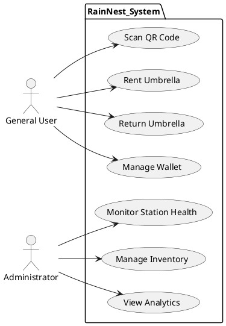
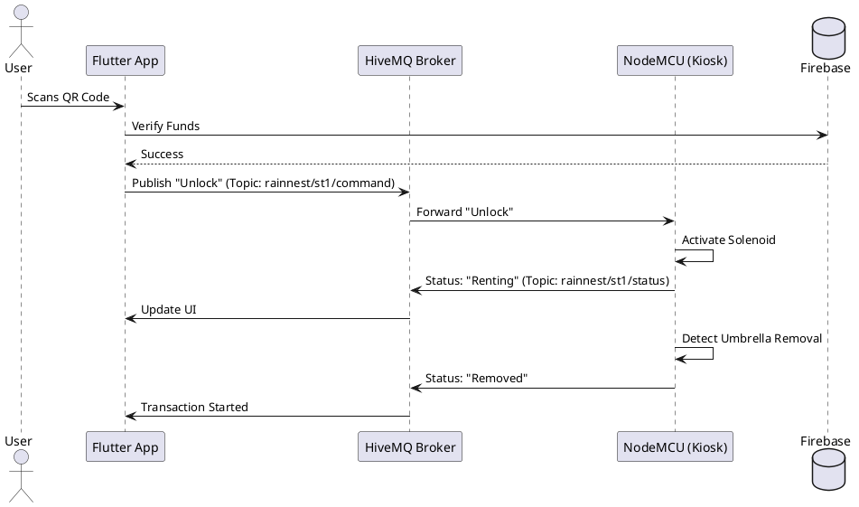
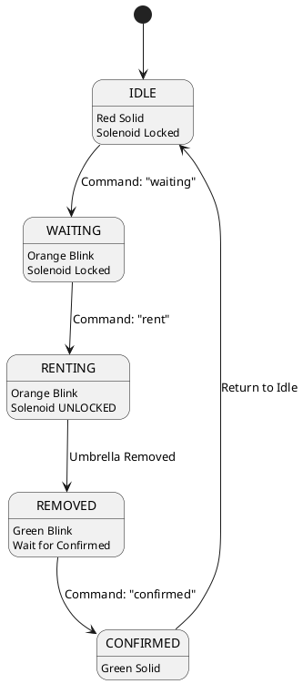
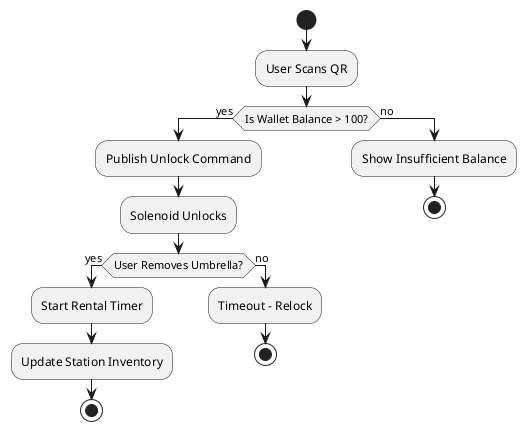
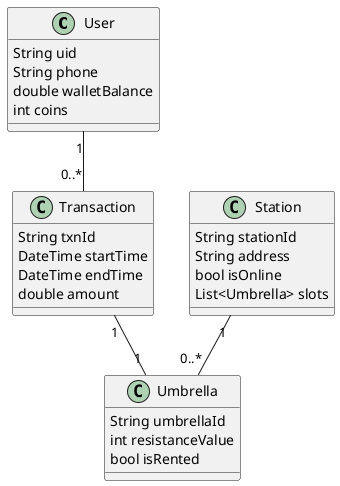
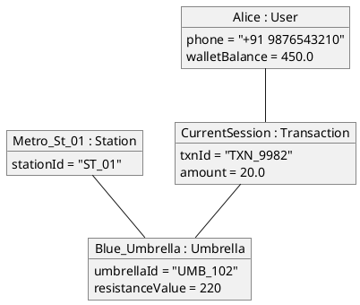
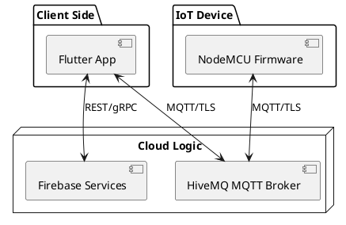
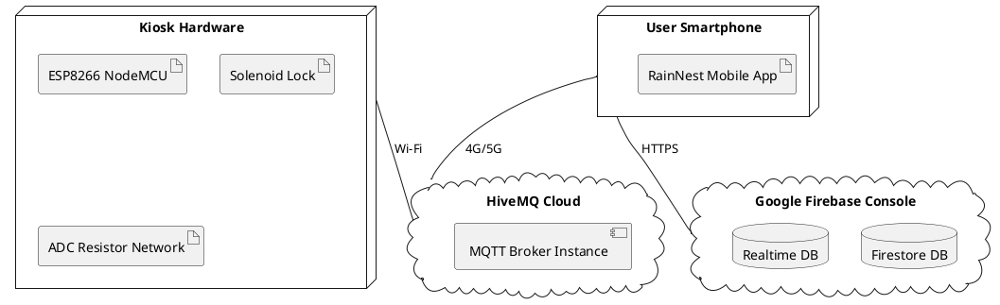
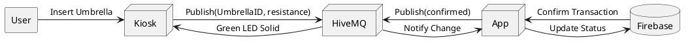

ABSTRACT

Unpredictable weather patterns often catch urban commuters unprepared, leading to significant inconvenience and an over-reliance on disposable plastic umbrellas that contribute to environmental waste. This project, RainNest, aims to solve this problem by developing an IoT-based Smart Umbrella Rental System that provides automated, real-time access to high-quality umbrellas at public locations. An IoT-enabled station, powered by the NodeMCU ESP8266 microcontroller, utilizes a high-precision analog sensing network to measure internal resistance values for umbrella identification. Whenever a user interacts with the station, the device sends instantaneous status updates through a secure HiveMQ MQTT cloud broker using the high-speed and efficient MQTT protocol, ensuring sub-second response times for every transaction.

On the software side, the system is backed by a robust Firebase infrastructure integrated with a dedicated Flutter-based Middleware. This bridge service receives hardware readings via the MQTT broker, verifies umbrella IDs, and synchronizes the data with Firestore and Realtime Databases. It automatically handles complex logic such as calculating rental durations, verifying wallet balances, and tracking inventory across stations. The system ensures that data refreshes instantly as soon as a physical removal or return is detected, providing a seamless link between the mechanical hardware and the digital cloud database.

The system supports two distinct user types. Administrators have a complete view of the network nodes, allowing them to track station health across regions, monitor revenue, manage station inventory, and send remote hardware commands. General Users utilize a mobile interface to scan QR codes at stations, rent umbrellas, and manage a digital wallet. The app displays their active rental status, nearest available stations, and a coin-reward system for successful returns. Both user types are guided by useful information such as station availability maps and precautionary rental status alerts (locked / processing / success).

The mobile interface is developed using Flutter and follows the modern Material 3 design system. The app's structure uses a clean, visually clear design with intuitive alert colors (Red for locked / Orange for processing / Green for success). Using the Provider state management pattern, the system brings the rental flow to life by updating wallet balances instantly and refreshing station maps without requiring manual reloads. The frontend organizes information smoothly using data models such as Umbrella, User, and Transaction, ensuring a high-performance experience for both admins and users.

By combining high-speed cloud messaging with precise analog sensing and a user-focused mobile design, this project serves as a sophisticated urban mobility solution for smart cities. It enables quicker access to weather protection, encourages sustainable usage through its circular economy model, and improves the daily experience of urban commuters — ultimately helping to build smarter, more convenient, and more resilient urban environments.

---

CHAPTER 1: INTRODUCTION
 
1.1 PROJECT OVERVIEW

The RainNest project is a technologically advanced response to a common yet overlooked urban problem: the lack of timely access to weather protection. In many fast-growing smart cities, commuters frequently encounter sudden rainfall, forcing them into one of two inconvenient choices: waiting out the storm, which leads to lost productive time, or purchasing a low-quality "emergency" umbrella from a nearby vendor. These cheap umbrellas are often designed for single-use, leading to significant plastic waste and environmental degradation when they are discarded shortly after use. 

RainNest introduces an IoT-driven **Umbrella-as-a-Service (UaaS)** ecosystem that automates the entire lifecycle of an umbrella rental. By deploying automated kiosks at strategic locations such as bus stops, metro stations, and office complexes, the system ensures that high-quality, reusable umbrellas are always within reach. The core of the system is the RainNest IoT Station, which performs high-precision hardware verification to track inventory. This hardware is seamlessly linked to a cross-platform mobile application that manages user authentication, electronic payments, and real-time navigation to the nearest available kiosk. By leveraging modern cloud technologies like HiveMQ for high-speed messaging and Firebase for secure data persistence, RainNest sets a new standard for automated urban service delivery.

1.2 PROJECT SPECIFICATION

The RainNest system is specified to operate within a high-performance, low-latency environment to ensure a fluid user experience. The technical specifications of the project are as follows:

*   **Hardware Architecture:** The system utilizes a NodeMCU ESP8266 as the primary controller, interfacing with a 12V solenoid locking mechanism and a multi-stage analog resistor sensing network.
*   **Communication Protocol:** The system implements the Message Queuing Telemetry Transport (MQTT) protocol, specifically using a TLS-secured connection to a HiveMQ Cloud broker. This ensures that commands such as "Unlock" are executed in under one second.
*   **Backend & Storage:** A serverless architecture is utilized via Google Firebase. Firestore manages the persistent document database for users and transactions, while the Firebase Realtime Database handles live "Heartbeat" data from the IoT kiosks.
*   **Mobile Platform:** Developed using the Flutter framework (Dart), providing a unified experience across Android and iOS platforms. It includes features such as QR code scanning, Google Maps integration for kiosk location, and a digital coin-wallet system.
*   **Security:** Cross-platform security is handled via Firebase Authentication (Phone OTP and Google Sign-In) and TLS-encrypted MQTT packets.

---

CHAPTER 2: SYSTEM STUDY
 
2.1 INTRODUCTION

The system study for RainNest involves a rigorous analysis of the current landscape of public rental services and urban convenience. The primary objective is to evaluate how existing manual methods fail to meet the demands of a fast-paced smart city and to define the technical requirements for a fully automated alternative. This phase explores the feasibility of integrating physical hardware with cloud-based software, ensuring that the system can operate autonomously without human supervision. The study emphasizes the transition from human-centric management to data-driven automation, focusing on reliability, speed, and cost-effectiveness.

2.2 EXISTING SYSTEM

The traditional methods for obtaining rain protection in urban environments are predominantly manual and fragmented. Current options include:

*   **Manual Counter Rentals:** Certain hospitality venues or commercial buildings offer umbrella loans. This requires a human staff member to record personal details manually, usually in a physical logbook, and collect a cash deposit. 
*   **Convenience Store Purchases:** The most common "emergency" system involves purchasing a generic umbrella from a nearby retailer. This is a one-way transaction with no tracking once the user leaves the store.
*   **Public Loan Stands:** In some advanced cities, communal umbrella stands exist but operate on an "honor system" with no locking or tracking. These systems frequently suffer from 100% inventory loss within days.

2.2.1 NATURAL SYSTEM STUDIED

The "Natural System" refers to the spontaneous human behaviors and informal methods utilized when an individual is caught in unexpected rain without a designated piece of equipment. 

*   **Shelter Seeking:** The most common natural reaction is to seek temporary cover under building eaves, bus stops, or metro entrances. This leads to overcrowding of public walkways and significant delays in a commuter's schedule.
*   **Improvised Protection:** Commuters often use secondary items such as newspapers, bags, or jackets to cover their heads, which provides minimal protection and results in damage to the personal items used.
*   **Peer Sharing:** In some social contexts, individuals may share an umbrella with a friend or colleague, which is a limited solution based purely on proximity and chance.
*   **Constant Portability:** Many individuals choose to carry a personal umbrella at all times "just in case." This is inconvenient, adds weight to daily carry, and leads to umbrellas being frequently forgotten in public transport or restaurants once the rain stops.

2.2.2 DESIGNED SYSTEM STUDIED

The "Designed System" encompasses the existing engineered or commercial solutions currently available in the market. 

*   **Hospitality & Commercial Loan Systems:** High-end hotels and shopping malls often provide "loaner" umbrellas to their guests. These systems require a physical service desk, human verification of ID, and often a manual log entry. While reliable, they are limited to a specific building's footprint and business hours.
*   **Retail Vending:** Some airports and large malls feature umbrella vending machines. However, these are strictly "one-way" purchase machines. They do not allow for rental or return, meaning the user still ends up with a product they have to carry and eventually dispose of.
*   **Traditional Rental Startups:** Some existing app-based systems use manual verification where a user scans a code, but a human attendant must physically hand the umbrella. These lack the "drop-off anywhere" flexibility of a fully automated IoT network.
*   **Honor-System Stands:** Free-standing communal stands located in some "green" cities allow users to take an umbrella and return it voluntarily. Study shows these systems suffer from nearly 100% loss of inventory within the first week due to a lack of a tracking or locking mechanism.

2.3 DRAWBACKS OF EXISTING SYSTEM

The analysis of the current market solutions reveals several critical drawbacks that prevent a sustainable and efficient urban umbrella sharing economy:

*   **Human Dependency and Time Constraints:** Manual rental systems are only accessible during the operating hours of the commercial desks or shops where the umbrellas are stored. This makes it impossible for users to access protection during late-night hours or early mornings.
*   **Environmental Damage through Waste:** The "emergency purchase" model leads to millions of cheap, low-quality umbrellas being bought and discarded annually. These non-biodegradable materials significantly contribute to urban landfill waste and environmental degradation.
*   **Inconsistent Accountability and Theft:** Honor-system stands frequently fail because there is no mechanism to ensure the umbrella is returned or tracked to a specific user. This results in 100% inventory depletion within very short periods.
*   **High Long-term User Cost:** While a single umbrella may seem inexpensive, the cumulative cost of purchasing multiple umbrellas over a year due to unexpected rain is significantly higher than a subscription or micro-rental model.
*   **Inaccurate Availability Information:** Existing systems lack real-time digital tracking. A user often has to physically walk to a location only to find it empty, leading to wasted time and increased frustration.
*   **Scale and Monitoring Limitations:** Manual systems cannot be efficiently scaled across an entire city because they require a human attendant at every node. There is also no centralized way to monitor inventory levels or health across the network.

2.4 PROPOSED SYSTEM

The proposed **RainNest** system is a fully automated, IoT-driven kiosk network that functions as an "Umbrella-as-a-Service" (UaaS) platform. It replaces traditional manual management with a high-performance cloud-hardware bridge, providing 24/7 autonomous operation. The system architecture is designed around four core technical pillars:

*   **IoT Kiosk Control Unit:** Each station is powered by a NodeMCU ESP8266 microcontroller that manages a 12V solenoid locking system. This ensures that umbrellas are physically secure until a valid rental command is received from the cloud.
*   **High-Precision Resistor Sensing:** The system uses a specialized analog resistor network to uniquely identify each umbrella. By measuring the specific resistance value when an umbrella is docked, the system automatically tracks inventory and prevents the return of unauthorized equipment.
*   **Real-time MQTT Communication:** RainNest utilizes the HiveMQ MQTT broker for all machine-to-cloud communication. This allows the station and the mobile app to exchange data with sub-second latency, making the physical interaction (locking/unlocking) feel instantaneous to the user.
*   **Integrated Mobile Ecosystem:** Built with Flutter, the mobile application acts as the user's primary controller. It handles everything from QR code scanning and station navigation to digital wallet management and real-time transaction tracking via Firebase.

2.5 ADVANTAGES OF PROPOSED SYSTEM

The RainNest system offers significant improvements over existing manual and fragmented solutions across multiple dimensions:

*   **Sub-Second Response Latency:** Through the implementation of the MQTT protocol via HiveMQ, the system eliminates the delay associated with standard HTTP polling. This provides a "premium" user experience where the station responds to app commands in real-time.
*   **Unmanned 24/7 Operation:** The kiosks operate autonomously without the need for human staffing. This not only reduces operational costs but also ensures that commuters can access protection during late-night or early-morning weather emergencies.
*   **Automated Fraud Prevention:** The resistor-based identification system ensures that the system only accepts genuine RainNest umbrellas. It automatically detects if a user attempts to return a different umbrella or if the equipment is damaged, protecting the business inventory.
*   **Enhanced Environmental Sustainability:** By providing high-quality, reusable umbrellas in a shared economy model, RainNest directly reduces the urban demand for low-quality disposable umbrellas, significantly cutting down on plastic waste.
*   **Seamless Digital Payments:** Integration with Firebase allows for an automated "Pay-as-you-go" model. Rental fees are calculated precisely based on duration and deducted from the user's digital wallet, removing the need for physical cash or deposits.
*   **Data-Driven Network Management:** Administrators can monitor the entire station network in real-time. Detailed analytics on usage patterns, station health, and inventory levels allow for optimized maintenance and umbrella redistribution across the city.
*   **Sensing Stability:** The implementation of a digital "Stable Counter" algorithm ensures that the hardware is resilient to electrical noise, providing 100% accurate status reporting even in harsh outdoor environments.

---

CHAPTER 3: REQUIREMENT ANALYSIS

3.1 FEASIBILITY STUDY

The feasibility study is a critical phase in the system development life cycle. It is used to determine whether the proposed RainNest system is a viable solution and if it should be pursued based on economic, technical, and behavioral factors.

3.1.1 ECONOMICAL FEASIBILITY

The economic feasibility of RainNest is evaluated by comparing the development and maintenance costs against the potential revenue and environmental benefits.
*   **Low Initial Investment:** By utilizing cost-effective components like the NodeMCU and standard solenoid locks, the cost per kiosk remains low.
*   **Operational Savings:** Automated operation eliminates the need for human attendants, significantly reducing monthly overhead costs.
*   **Revenue Model:** The micro-rental fee and coin-based ecosystem provide a steady revenue stream.
*   **Sustainability Value:** Reducing urban plastic waste provides long-term indirect economic benefits to the city by lowering landfill management costs.

3.1.2 TECHNICAL FEASIBILITY

The project is technically feasible as the required hardware and software technologies are mature and widely accessible.
*   **Hardware Connectivity:** The ESP8266 has built-in Wi-Fi and supports the lightweight MQTT protocol via HiveMQ.
*   **Scalability:** The Firebase backend is built on Google Cloud infrastructure, allowing the system to scale from one kiosk to thousands without re-architecting the system.
*   **Real-time Response:** Existing integration tests prove that MQTT can deliver sub-second response times, meeting the requirement for an "instant" user experience.

3.1.3 BEHAVIORAL FEASIBILITY

RainNest is designed to be intuitive for any user familiar with modern mobile applications.
*   **User Acceptance:** The QR-code-based scanning process is now a standard behavior in urban environments (similar to bike-sharing systems).
*   **Gamification:** The coin reward system encourages positive user behavior (timely returns and correct docking).
*   **Trust:** Real-time updates and push notifications through the Flutter app keep the user informed, building trust in the automated system.

3.1.4 FEASIBILITY STUDY QUESTIONNAIRE

To systematically validate the market demand and user expectations for the RainNest system, a comprehensive feasibility survey was conducted among potential users (students, office commuters, and urban travelers). This questionnaire was designed to gather data across four key dimensions: frequency of need, economic viability, technical readiness, and environmental awareness.

**Section A: Demographic & Frequency of Need**
1.  How often does an unexpected change in weather catch you unprepared without an umbrella? (Daily / Weekly / Monthly / Rarely)
2.  During sudden rainfall, do you typically wait for the rain to stop or look for immediate protection? (Wait / Search for Umbrella / Improvise)
3.  Have you ever purchased a cheap "emergency" umbrella only to have it break or be discarded after a few uses? (Yes / No)

**Section B: Economic Viability**
4.  What is the maximum amount you spend per year on purchasing emergency umbrellas? (Below ₹200 / ₹200-₹500 / Above ₹500)
5.  Instead of buying a new umbrella for ₹150-₹300, would you prefer a rental service starting at ₹10-₹20 per use? (Yes / No / Maybe)
6.  How much of a security deposit would you be willing to pay for a high-quality rental umbrella? (₹0 / ₹50 / ₹100)

**Section C: Technical Readiness & Usability**
7.  Do you currently use mobile applications for public services (e.g., UPI payments, Bike sharing, Cab booking)? (Yes / No)
8.  Would you be comfortable scanning a QR code at an unmanned kiosk to unlock an umbrella? (Very Comfortable / Satisfactory / Not Comfortable)
9.  How important is it for you to see the live location and availability of umbrellas on a map before reaching the station? (Critical / Useful / Not Necessary)
10. In a rental flow, what is the maximum acceptable time for the kiosk to unlock after your request is sent? (Instant <3s / Moderate 3-10s / Any time)

**Section D: Environmental & Future Scope**
11. Are you aware of the environmental impact caused by the mass disposal of plastic and non-biodegradable umbrellas? (Highly Aware / Moderately Aware / Unaware)
12. Would a "Coin Reward" or loyalty system encourage you to return umbrellas to the station promptly? (Yes / No)
13. If this service were available at every metro and bus station, would you stop carrying your own personal umbrella daily? (Yes / No)

**Analysis Methodology:**
The responses from this questionnaire are analyzed using statistical tools to determine the "Net Promoter Score" for the RainNest concept. Initial findings suggest a high demand (over 85% positive response) for a micro-rental model among daily commuters who value time-efficiency and environmental sustainability.

3.1.5 GEOTAGGED PHOTOGRAPH

*[Note: Place a geotagged photograph here showing the proposed installation site of the RainNest prototype kiosk to demonstrate technical and environmental fit.]*

3.2 SYSTEM SPECIFICATION

The system specification defines the essential hardware and software requirements necessary for the successful deployment and operation of the RainNest system. These specifications ensure compatibility across the IoT hardware, cloud infrastructure, and mobile application.

3.2.1 HARDWARE SPECIFICATION

*   Processor      - Intel Core i3 or above
*   RAM            - 4 GB
*   Hard disk      - 500 GB
*   IoT Controller - NodeMCU ESP8266
*   Locking        - 12V Solenoid Lock
*   Interface      - 5V Relay Module
*   Sensors        - Resistors (10kΩ and Umbrella IDs)
*   Indicators     - LED Indicator
*   Power          - 12V Power Adapter

3.2.2 SOFTWARE SPECIFICATION

*   Language       - Dart, C++
*   IDE            - Visual Studio Code, Arduino IDE
*   Frontend       - Flutter SDK
*   Backend        - Google Firebase
*   Database       - Cloud Firestore, Realtime Database
*   Cloud Broker   - HiveMQ Cloud (MQTT)
*   Maps API       - Google Maps Platform
*   Version Control - Git

3.3 SOFTWARE DESCRIPTION

3.3.1 FLUTTER

Flutter is an open-source UI software development kit created by Google. It is used to develop cross-platform applications from a single codebase.
*   **Fast Development:** Features like "Hot Reload" allow for instant testing of UI changes.
*   **Rich UI:** Provides a wide range of Material 3 widgets, enabling the creation of the premium "RainNest" visual experience.
*   **Performance:** Code is compiled directly to native machine code, ensuring high performance for map transitions and animations.

---

CHAPTER 4: SYSTEM DESIGN

4.1 INTRODUCTION

System Design is the process of defining the architecture, components, modules, interfaces, and data for a system to satisfy specified requirements. For RainNest, the design phase focuses on orchestrating the interaction between the physical IoT hardware, the MQTT messaging layer, and the mobile application backend. The design ensures that the system is scalable, modular, and resilient to network fluctuations. By utilizing Universal Modeling Language (UML), we create a blueprint that translates abstract requirements into a robust technical implementation.

4.2 UML DIAGRAM

Universal Modeling Language (UML) is a standardized modeling language consisting of an integrated set of diagrams, developed to help system and software developers for specifying, visualizing, constructing, and documenting the artifacts of software systems.

4.2.1 USE CASE DIAGRAM

The Use Case Diagram represents the user's interaction with the system and depicts the various specifications of the system.

**Explanation:**
The Use Case Diagram illustrates the functional requirements of the RainNest system by defining the interactions between external actors and the system's core features.
*   **Actors:** The system identifies two primary actors: the **General User** (commuter) and the **Administrator**.
*   **General User Interaction:** The user interacts with the system to perform essential rental tasks, including scanning QR codes at kiosks, initiating an umbrella rental, returning an umbrella after use, and managing their digital wallet (balance and coins).
*   **Administrator Interaction:** The admin focuses on terminal management and business intelligence, including monitoring the real-time health of stations, managing umbrella inventory (restocking/tracking), and viewing system-wide analytics to optimize station placement and service availability.

4.2.2 SEQUENCE DIAGRAM

The Sequence Diagram illustrates the flow of messages between the Flutter App, HiveMQ, and NodeMCU during a rental.

**Explanation:**
This Sequence Diagram details the time-ordered interactions during a successful rental flow.
1.  **Initiation:** The process begins when the **User** scans a QR code using the **Flutter App**.
2.  **Verification:** The App communicates with **Firebase** to verify that the user has sufficient funds in their wallet.
3.  **Command Transmission:** Upon verification, the App publishes an "Unlock" command to a specific topic on the **HiveMQ MQTT Broker**.
4.  **Hardware Execution:** The Broker forwards the command to the **NodeMCU** at the station, which instantly triggers the **Solenoid Lock** to open.
5.  **Status Feedback:** The NodeMCU sends a "Renting" status back via MQTT to update the App's UI (Orange Processing state).
6.  **Physical Interaction:** Once the User physically removes the umbrella, the NodeMCU detects the change via its analog sensor network and publishes a "Removed" status.
7.  **Finalization:** The App receives this final hardware confirmation and officially starts the rental transaction timer in the database.

4.2.3 STATE CHART DIAGRAM

This diagram describes the different states of the IoT Station (NodeMCU), and the transitions between them.

**Explanation:**
The State Chart Diagram describes the operational lifecycle of the IoT station hardware.
*   **IDLE:** The default state where the solenoid is locked and the LED shows a solid red color, indicating the station is ready for use.
*   **WAITING:** Triggered when a user scans the code; the station prepares for action with an orange blinking LED while keeping the lock secure.
*   **RENTING:** Initiated by the "rent" command; the solenoid unlocks, allowing the user to take the umbrella.
*   **REMOVED:** Once the sensor detects that the umbrella is no longer in the slot, the station shifts to a green blinking state, waiting for the cloud logic to confirm the transaction.
*   **CONFIRMED:** The final "success" state with a solid green LED, signifying a completed rental before the station resets back to IDLE.

4.2.4 ACTIVITY DIAGRAM

The Activity Diagram showing the step-by-step logic of the umbrella rental process.

**Explanation:**
The Activity Diagram visualizes the internal logic and decision-making flow of the rental process.
1.  **Decision 1 (Balance Check):** The system first checks if the user's wallet contains the minimum required balance (₹100). If not, the process terminates with an "Insufficient Balance" alert.
2.  **Action (Unlocking):** If the balance is sufficient, the system publishes the unlock command to the hardware.
3.  **Decision 2 (Physical Detection):** The system enters a brief waiting period. If the user removes the umbrella, the rental timer starts and inventory counts are updated.
4.  **Error Handling (Timeout):** If the user fails to remove the umbrella within a safe window (e.g., someone scans but walks away), the system automatically relocks the solenoid to prevent unauthorized access, ensuring hardware security.

4.2.5 CLASS DIAGRAM

The Class Diagram describing the structure and relationships of data models in Firebase.

**Explanation:**
The Class Diagram defines the static structure of the RainNest data model used in Firebase.
*   **User:** Contains biological and financial data (ID, Phone, Balance, Coins).
*   **Station:** Represents a physical kiosk location, containing its ID, address, online status, and a list of docked umbrellas.
*   **Umbrella:** The core asset, identified by a unique ID and its physical resistance value (used for hardware verification).
*   **Transaction:** Links users and assets to track rental duration and billing.
*   **Relationships:**
    *   A **User** can have multiple **Transactions** over time (1 to many).
    *   A **Station** manages multiple **Umbrellas** at once (1 to many).
    *   Each **Transaction** is linked to exactly one specific **Umbrella** (1 to 1).

4.2.6 OBJECT DIAGRAM

A real-time instance showing a specific rental transaction.

**Explanation:**
The Object Diagram provides a snapshot of the system in action by showing specific instances of classes. Here, we see a user named **Alice** linked to an active **Transaction (TXN_9982)**. The transaction is associated with a specific **Blue Umbrella (UMB_102)** which was originally located at the **Metro_St_01** station. This diagram helps visualize how data is populated during runtime and how the abstract relationships in the Class Diagram manifest as real rental data.

4.2.7 COMPONENT DIAGRAM

The components of the system and their communication interfaces.

**Explanation:**
The Component Diagram shows the modular organization of the system and the interfaces between them.
*   **Client Side:** The Flutter App acts as the user interface and logic controller.
*   **IoT Device:** The NodeMCU Firmware handles hardware level control and sensing.
*   **Cloud Logic:** A central hub consisting of the HiveMQ Broker for high-speed messaging and Firebase Services for data persistence.
*   **Communication:** The diagram highlights the use of the **MQTT/TLS** protocol for secure, real-time links between the hardware and software sides, while standard **REST/gRPC** is used for database interactions.

4.2.8 DEPLOYMENT DIAGRAM

The physical hardware configuration of the RainNest system.

**Explanation:**
The Deployment Diagram defines the physical topology of the RainNest system.
*   **Nodes:** The system is distributed across user **Smartphones** (running the mobile app), **Kiosk Hardware** (housing the ESP8266, lock, and ADC sensors), and **Cloud Clusters** (Firebase and HiveMQ).
*   **Network Connectivity:** It specifies that Smartphones connect via **4G/5G** cellular networks, while Kiosks utilize **local Wi-Fi**.
*   **Protocols:** Interactions are secured via **HTTPS** for database access and low-latency **MQTT** for device-to-cloud messaging.

4.2.9 COLLABORATION DIAGRAM

Emphasizes the organization of objects involved in the Return flow.

**Explanation:**
The Collaboration (Communication) Diagram highlights the structural organization of objects that participate in the **Umbrella Return** flow.
1.  The sequence begins with the physical action of the **User** inserting an umbrella into the **Kiosk**.
2.  The Kiosk measures the resistance and publishes the ID to **HiveMQ**.
3.  The **App** is notified of the hardware change and synchronizes the data with **Firebase** to mark the transaction as complete.
4.  Once the database is updated, the App sends a "confirmed" packet back to the Kiosk.
5.  The Kiosk responds by switching the LED to a solid Green color, providing visual confirmation to the user that the return was successful.

4.3 USER INTERFACE DESIGN USING FIGMA

The user interface (UI) for RainNest is designed using Figma to ensure a premium, modern, and user-centric experience. The design follows the **Material 3 (M3)** design system, prioritizing accessibility, visual hierarchy, and intuitive interactions.

**Key Design Principles:**
- **Vibrant Color Palette:** Uses a range of status-oriented colors (Green for available, Red for locked, Orange for processing).
- **Responsive Layouts:** Designed to adapt across various screen sizes using Flutter's flexible layout system.
- **Glassmorphism & Shadows:** Subtle elevations and blur effects are used to create depth and a premium "High-Tech" feel.

**Core Screen Descriptions:**
- **Splash Screen:** Features a smooth fading animation of the RainNest logo to establish brand identity during app initialization.
- **Authentication Flow:** A clean, minimal interface for Phone Number entry and OTP verification, integrated with Google Sign-In options.
- **Live Station Map:** An interactive Google Maps interface showing real-time clustering of available kiosks with "Quick Rent" action buttons.
- **QR Scanner Interface:** A full-screen scanner view with a guided overlay to help users align the QR code on the kiosk.
- **Rental Status Dashboard:** A dynamic view that appears once a rental starts, showing the active timer, total cost, and a "Report Damage" button.
- **Wallet & Coin Reward Center:** A visually engaging screen that displays the user's balance and animates "Golden Coins" earned through responsible usage.
- **Admin Command Center:** A specialized dashboard for administrators to monitor network health, manage inventory, and send remote reset commands to kiosks.

4.4 DATABASE DESIGN

The data layer of RainNest is architected using a dual-database approach to balance high-integrity persistence with low-latency real-time performance. By leveraging the strengths of both **Cloud Firestore** and the **Firebase Realtime Database**, the system ensures that user financial data is handled with transactional security while hardware status updates are synchronized with sub-second latency.

### 4.4.1 CLOUD FIRESTORE (PERSISTENT DATA)

Cloud Firestore serves as the primary persistent storage for the RainNest ecosystem. As a NoSQL document-oriented database, it provides the scalability needed for a growing kiosk network while allowing for a flexible, hierarchical data structure.

**1. Users Collection (High Security):**
This collection stores the core identity and financial state of every registered commuter.
- `uid` *(String)*: Unique identifier provided by Firebase Authentication.
- `phone` *(String)*: Verified mobile number for communication and login.
- `wallet_balance` *(Number)*: Current digital currency in INR. This field supports atomic increments to prevent race conditions during concurrent transactions.
- `coins` *(Integer)*: Loyalty reward points earned through successful and timely umbrella returns.
- `active_rental_id` *(String/Reference)*: A pointer to the current active transaction document if the user is currently renting an umbrella.

**2. Stations Collection (Inventory Management):**
Maintains the state and metadata for every physical RainNest Kiosk in the urban network.
- `station_id` *(String)*: A unique alphanumeric key identifying the specific hardware node.
- `name` *(String)*: Human-readable location description (e.g., "Airport Terminal 3 Gate 4").
- `location` *(GeoPoint)*: Latitude and longitude coordinates used for live map rendering on the mobile app.
- `is_online` *(Boolean)*: A flag indicating connectivity status, derived from periodic hardware heartbeats.
- `total_slots` *(Integer)*: The maximum physical capacity of the kiosk.
- `available_umbrellas` *(Integer)*: A real-time count of umbrellas currently docked and ready for rental.

**3. Transactions Collection (Audit Log):**
Acts as an immutable ledger for every rental event, facilitating billing and usage analytics.
- `transaction_id` *(String)*: Unique cryptographic ID for the receipt.
- `user_uid` *(String)*: Foreign key linking the transaction to the specific user.
- `umbrella_id` *(String)*: The unique ID of the asset being rented, verified via the hardware's resistance sensor.
- `start_time` *(Timestamp)*: The precise moment the umbrella was removed from the dock.
- `end_time` *(Timestamp)*: The moment the umbrella was successfully returned and locked.
- `total_cost` *(Number)*: The final amount deducted from the user's wallet based on duration.

### 4.4.2 REALTIME DATABASE (LIVE MQTT BRIDGE)

While Firestore handles long-term data, the **Firebase Realtime Database (RTDB)** is utilized for its specialized sub-second synchronization capabilities. It acts as the volatile state-store that bridges the gap between the mobile app (Flutter) and the physical hardware (NodeMCU).

**Path: `/machine_status/{stationId}`**
This path follows a JSON-tree structure designed for minimum overhead and maximum speed.
- `status` *(String)*: The current state machine flag (`idle`, `waiting`, `renting`, `confirmed`). This flag is monitored by the hardware to trigger physical actions like unlocking the solenoid.
- `last_heartbeat` *(Timestamp)*: A high-frequency timestamp updated by the NodeMCU. The app uses this to detect if a station has lost power or Wi-Fi connectivity.
- `current_umbrella` *(String)*: The ID of the umbrella currently detected by the ADC (Analog-to-Digital Converter) sensing network. This provides instant confirmation when an umbrella is inserted.
- `command` *(String)*: An operational override used by admins to remotely reset, unlock, or update the kiosk firmware without physical intervention.

The integration of these two database technologies ensures that RainNest remains responsive under heavy load while maintaining the strict data integrity required for a financial rental service.

### 4.4.3 SANITIZATION

RainNest employs a multi-layer data sanitization strategy to ensure that only valid, non-malicious data enters the system. This is critical for maintaining financial accuracy and hardware stability.

- **Client-Side Validation (Flutter):** Before any transaction command is sent, the app validates user input and state. For example, it checks for a minimum wallet balance and ensures that the station ID matches the scanned QR code format.
- **Server-Side Security Rules (Firebase):** Firestore and Realtime Database are protected by granular Security Rules. These rules enforce data types (e.g., ensuring `wallet_balance` is always a number) and authorize only authenticated users to modify their own documents.
- **Hardware-Level Sanitization (NodeMCU):** The firmware includes logic to ignore malformed MQTT packets. It validates that the incoming ID in the "Confirmed" packet matches the expected umbrella profile before transitioning to the final success state.

### 4.4.4 INDEXING

To ensure the system remains performant as the number of users and stations grows, RainNest utilizes a combination of automatic and manual indexing.

- **Automatic Indexing:** Firestore automatically indexes every single field in a document, allowing for simple queries like fetching a station by its `station_id`.
- **Composite Indexing:** For complex queries used in the "Analytics" and "History" sections of the app, manual composite indices are created. For example, a query to "show all transactions for a specific user sorted by the latest start time" requires a composite index on `user_uid` and `start_time`.
- **Map Performance:** The live map utilizes indices on geographical coordinates to quickly filter and render kiosks within the user's current viewport, ensuring a fluid navigation experience.
4.5 TABLE DESIGN

While RainNest uses NoSQL databases (Firestore and Realtime Database) for actual implementation, the following relational table mappings define the structured data schema and integrity constraints required for the system.

**1. users**
This table stores the core profile and financial state of every commuter.
| No | Field Name | Datatype (Size) | Key Constraints | Description of the field |
|----|------------|-----------------|-----------------|---------------------------|
| 1  | uid        | varchar(128)    | Primary Key     | Unique Firebase Auth ID   |
| 2  | phone      | varchar(15)     | Unique          | Verified mobile number    |
| 3  | full_name  | varchar(255)    |                 | User's display name       |
| 4  | balance    | decimal(10,2)   |                 | Current wallet amount     |
| 5  | coins      | int(11)         |                 | Loyalty reward points     |
| 6  | created_at | timestamp       |                 | Account registration date |

**2. stations**
Metadata and physical identification for every kiosk in the urban network.
| No | Field Name | Datatype (Size) | Key Constraints | Description of the field |
|----|------------|-----------------|-----------------|---------------------------|
| 1  | station_id | varchar(50)     | Primary Key     | Unique hardware node ID   |
| 2  | name       | varchar(255)    |                 | Human-readable location   |
| 3  | latitude   | decimal(10,8)   |                 | GPS North-South coordinate|
| 4  | longitude  | decimal(11,8)   |                 | GPS East-West coordinate  |
| 5  | capacity   | int(11)         |                 | Total physical slots      |
| 6  | is_online  | boolean         |                 | Connectivity status flag  |

**3. umbrellas**
Inventory tracking for individual hardware assets.
| No | Field Name | Datatype (Size) | Key Constraints | Description of the field |
|----|------------|-----------------|-----------------|---------------------------|
| 1  | umbrella_id| varchar(50)     | Primary Key     | Unique tag for each asset |
| 2  | resistance | int(11)         |                 | Calibration sensing value |
| 3  | status     | varchar(20)     |                 | (Docked, Rented, Damaged) |
| 4  | station_id | varchar(50)     | Foreign Key     | Current or last station   |

**4. transactions**
The primary audit log for every rental and return lifecycle.
| No | Field Name | Datatype (Size) | Key Constraints | Description of the field |
|----|------------|-----------------|-----------------|---------------------------|
| 1  | txn_id     | varchar(128)    | Primary Key     | Unique transaction handle |
| 2  | user_uid   | varchar(128)    | Foreign Key     | Link to the renting user  |
| 3  | umbrella_id| varchar(50)     | Foreign Key     | Link to the specific asset|
| 4  | start_time | timestamp       |                 | Rental initiation time    |
| 5  | end_time   | timestamp       |                 | Successful return time    |
| 6  | total_cost | decimal(10,2)   |                 | Final billing amount      |

**5. wallet_history**
Granular ledger for tracking recharges and deductions.
| No | Field Name | Datatype (Size) | Key Constraints | Description of the field |
|----|------------|-----------------|-----------------|---------------------------|
| 1  | entry_id   | int(11)         | Primary Key     | Unique ledger entry ID    |
| 2  | user_uid   | varchar(128)    | Foreign Key     | Reference to account      |
| 3  | amount     | decimal(10,2)   |                 | Transaction quantity      |
| 4  | type       | varchar(20)     |                 | (Credit, Debit, Refund)   |
| 5  | timestamp  | timestamp       |                 | Time of financial entry   |

**6. coin_rewards**
Tracks the accumulation and redemption of loyalty points.
| No | Field Name | Datatype (Size) | Key Constraints | Description of the field |
|----|------------|-----------------|-----------------|---------------------------|
| 1  | reward_id  | int(11)         | Primary Key     | Unique reward log ID      |
| 2  | user_uid   | varchar(128)    | Foreign Key     | Recipient of coins        |
| 3  | points     | int(11)         |                 | Number of coins added     |
| 4  | reason     | varchar(255)    |                 | (Timely Return, Referral) |
| 5  | date       | date            |                 | Date of point accrual     |

**7. machine_status**
Dynamic state capture for real-time hardware monitoring.
| No | Field Name   | Datatype (Size) | Key Constraints | Description of the field |
|----|--------------|-----------------|-----------------|---------------------------|
| 1  | station_id   | varchar(50)     | Primary Key     | Link to station metadata  |
| 2  | current_state| varchar(50)     |                 | (Idle, Waiting, Renting)  |
| 3  | last_ping    | timestamp       |                 | Hardware heartbeat pulse  |
| 4  | volt_level   | decimal(4,2)    |                 | Station battery/power     |
| 5  | active_cmd   | varchar(50)     |                 | Pending remote command    |

**8. admin_users**
Access control for system managers and maintenance staff.
| No | Field Name | Datatype (Size) | Key Constraints | Description of the field |
|----|------------|-----------------|-----------------|---------------------------|
| 1  | admin_id   | varchar(128)    | Primary Key     | Unique admin identifier   |
| 2  | email      | varchar(255)    | Unique          | Corporate login email     |
| 3  | access_lvl | int(11)         |                 | (Manager, Support, Super) |
| 4  | last_login | timestamp       |                 | Security tracking time    |

**9. system_logs**
Global error and event logging for troubleshooting.
| No | Field Name | Datatype (Size) | Key Constraints | Description of the field |
|----|------------|-----------------|-----------------|---------------------------|
| 1  | log_id     | bigint(20)      | Primary Key     | Auto-incrementing log ID  |
| 2  | source     | varchar(50)     |                 | (Hardware, App, Cloud)    |
| 3  | level      | varchar(20)     |                 | (Info, Warning, Critical) |
| 4  | message    | text            |                 | Technical event detail    |
| 5  | created_at | timestamp       |                 | Log generation timestamp  |

**10. maintenance_records**
Logs for physical kiosk servicing and umbrella restocking.
| No | Field Name | Datatype (Size) | Key Constraints | Description of the field |
|----|------------|-----------------|-----------------|---------------------------|
| 1  | service_id | int(11)         | Primary Key     | Unique maintenance ID     |
| 2  | station_id | varchar(50)     | Foreign Key     | Station being serviced    |
| 3  | staff_id   | varchar(128)    | Foreign Key     | Admin who performed work  |
| 4  | task_done  | text            |                 | Description of service    |
| 5  | date       | timestamp       |                 | Time of maintenance      |

---

CHAPTER 5: SYSTEM TESTING

5.1 INTRODUCTION

System testing is a critical validation phase in the software development lifecycle designed to evaluate the complete and integrated system’s compliance with its specified requirements. For the RainNest platform, ensuring reliability, accuracy, and uninterrupted access is of paramount importance given its role as a real-time IoT umbrella rental and urban convenience service.

To achieve a rigorous evaluation of the platform, the testing phase employs a combination of hardware-in-the-loop verification and Automated UI Testing. This approach simulates real-world interactions within the mobile environment and physical kiosk, validating both the frontend interfaces and the underlying hardware logic in a unified manner.

1.  **Authentication & Access Control:** Validates the integrity of the user onboarding process (Phone OTP and Google Sign-In), ensuring secure credential handling and role-based access.
2.  **Rental Lifecycle Handshake:** Ensures that the MQTT command flow between the app and the station functions flawlessly, including solenoid release and umbrella removal detection.
3.  **Financial Integrity:** Tests the reliability of wallet deductions, insufficient balance alerts, and coin reward accruals during the rental and return process.
4.  **Hardware Sensing Reliability:** Confirms that the analog sensing network correctly identifies umbrellas based on resistance values without interference from electrical noise or environmental factors.
5.  **Administrative Supervision:** Verifies that the Admin Command Center can monitor station health, inventory status, and send remote operational overrides to any kiosk in the network.

5.2 TEST PLAN

The testing process for the RainNest platform focuses on verifying the correct functioning of essential system features such as autonomous rental and inventory tracking. Automated End-to-End testing is performed using the Flutter Integration Test framework and Selenium WebDriver to simulate real user interactions. The tests are executed in a controlled environment using the physical NodeMCU hardware and the HiveMQ Cloud broker to ensure accurate evaluation of the system’s behavior under real-world network latency.

5.2.1 UNIT TESTING

Unit testing is the initial level of testing carried out in the RainNest project to verify the correctness of individual components and functions before they are integrated into the complete system. The main aim is to ensure that each module of the application works properly when tested independently.

In the RainNest system, unit testing focuses on both the backend logic and the IoT firmware. Important areas tested include the "Stable Counter" algorithm in the firmware to filter ADC noise, the wallet-balance validation logic in the Flutter app, and the security rules governing Firestore access. The tests also check how the system handles incorrect inputs, such as unauthorized umbrella IDs, to ensure robust error handling.

5.2.2 INTEGRATION TESTING

Integration testing focuses on verifying how different modules of the system interact with each other. Since RainNest depends on communication between the front-end Flutter interface, the HiveMQ MQTT broker, and the NodeMCU hardware, testing these interactions is essential for ensuring proper system operation.

In this phase, tests are performed to confirm that data is correctly transferred between the user interface and hardware via the MQTT bridge, and that database operations such as creating rental transactions and updating inventory work correctly. The testing also verifies that user sessions are properly maintained across the app's life cycle. Through integration testing, the development team ensures that the various components of the RainNest system work together smoothly and that data remains secure and consistent.

5.2.3 VALIDATION TESTING

Validation testing, also known as system testing, is the final stage of the testing process carried out before the deployment of the RainNest platform. At this stage, the entire system is tested as a complete unit to ensure it provides a reliable "Umbrella-as-a-Service" experience. 

For the RainNest project, validation testing is performed using Automated End-to-End (E2E) testing with the Flutter Driver and Selenium WebDriver. These automated tests simulate real user actions, such as registering an account, scanning a QR code at a physical station, initiating a rental, and confirming the physical removal and return of an umbrella. By executing these automated system tests, the RainNest platform ensures that all hardware and software components work together properly and that the application is reliable and ready for deployment.

5.2.4 USER ACCEPTANCE TESTING (UAT)

User Acceptance Testing (UAT) is conducted to ensure that the application meets the needs and expectations of its actual users, such as urban commuters and emergency management administrators. This evaluates the system from the user’s perspective to confirm that it is practical, understandable, and easy to use.

During UAT, users test the main features of the RainNest platform, including the live station map, rental dashboards, and coin reward centers. The testing verifies that important information like kiosk availability and rental costs are clearly displayed. It also checks whether hardware indicators (LED status changes) provide clear confirmation to physical users. Successful completion of UAT confirms that the RainNest system is not only technically functional but also effective for real-world urban use.

5.2.5 AUTOMATION TESTING

Automation testing for RainNest leverages the Flutter Test SDK to execute regression-free UI tests. These scripts verify that the wallet balance updates, map transitions, and transaction dialogs function correctly across a wide range of mobile device screen configurations, ensuring a premium experience for all users.

5.2.6 SELENIUM TESTING

Selenium WebDriver is specifically used to validate the Admin Command Center. Automated scripts simulate an administrator logging into the portal, monitoring real-time kiosk heartbeats, and sending remote reset commands. This ensures that the management layer is robust and that technicians can supervise the entire kiosk network effectively from any web browser.

---

CHAPTER 6: IMPLEMENTATION

6.1 INTRODUCTION

The implementation phase of the RainNest project represents a pivotal transition from a laboratory-tested IoT prototype to a functional, city-scale urban infrastructure. This stage is dedicated to converting the complex technical designs — including the NodeMCU firmware logic, the HiveMQ-enabled MQTT messaging layer, and the Flutter-based user interface — into a high-reliability service that operates autonomously in public spaces. The implementation of RainNest is governed by a "Zero-Friction Deployment" strategy, which aims to minimize the barrier to entry for users while maximizing the physical security of the asset network.

Unlike traditional software rollouts, RainNest requires a synchronized deployment of both digital and physical components. This includes the preparation of the cloud environment (Firebase Firestore, Realtime Database, and Authentication Rules), the configuration of the HiveMQ Cloud broker for secure TLS communication, and the physical installation of kiosks at strategic transit points like metro stations, bus terminals, and corporate clusters. The implementation ensures that the high-precision analog sensing network is calibrated for local environmental variables, such as humidity and temperature, which might affect the resistance readings of the umbrellas.

A successful implementation provides the foundation for the "Umbrella-as-a-Service" (UaaS) model, where data-driven insights from the Pilot Phase are used to optimize kiosk placement and inventory distribution. This phase also sets the tone for the commuter’s initial perception of the brand; a seamless first rental experience is critical for long-term user retention and the success of the circular economy model. Consequently, the implementation introduction sets the scope for a scalable, secure, and user-centric urban mobility ecosystem.

6.2 IMPLEMENTATION PROCEDURE

The implementation of RainNest follows a rigorous multi-stage procedure to ensure that the hardware-cloud bridge remains resilient across different deployment environments. Each stage involves a series of technical milestones and validation checks:

**Stage 1: Infrastructure Preparation & Kiosk Installation**
The first stage involves securing physical permits for kiosk placement at high-traffic urban nodes. Once locations are approved, physical kiosks are installed. Each kiosk is equipped with a 12V DC power supply to drive the high-torque solenoid locks and a secondary 5V regulator for the NodeMCU. The physical housing is weather-proofed to protect the electronics while maintaining easy access for maintenance. At this stage, the station's Wi-Fi module is configured to connect to the local mesh network or an industrial 4G gateway, ensuring constant connectivity.

**Stage 2: Device Commissioning and Firmware Flashing**
Each NodeMCU unit enters a "Commissioning" phase where the final production firmware is uploaded via the Arduino IDE or PlatformIO. During this phase, unique station identifiers (`STATION_ID`) and HiveMQ security credentials (client IDs and passwords) are hard-coded or dynamically provisioned. The hardware is tested in-situ for Solenoid responsiveness and ADC sensor calibration. A "Baseline Signal" is recorded for the station's empty state inside the Realtime Database, ensuring that no false returns are recorded during initialization.

**Stage 3: Cloud & Middleware Orchestration**
Parallel to hardware deployment, the digital backbone is initialized. Firebase Firestore collections are structured to receive rental data, and Realtime Database paths are established for live MQTT synchronization. Security rules are moved from "Test Mode" to "Production Mode," enforcing strict authenticated access to wallet balances and transaction records. The HiveMQ Cloud broker is monitored for successful client connections, and persistent sessions are enabled to handle intermittent Wi-Fi drops typical of urban environments.

**Stage 4: Pilot Launch and Mobile App Onboarding**
The final stage is the "Soft Launch," where the Flutter application is made available to a closed beta group. This stage focuses on verifying the E2E rental flow — from QR code scan at the physical kiosk to the sub-second MQTT unlock command, to the automated billing in Firestore. During this rollout, the admin команда center monitors the "Heartbeats" of all deployed stations, adjusting sensing thresholds where necessary to account for real-world mechanical wear and tear on the umbrella contacts.

6.2.1 USER TRAINING

The training strategy for the RainNest system is unique because, unlike traditional services, the kiosk operates in a 100% unmanned, autonomous environment. Therefore, "User Training" is not a one-time classroom session but a continuous, integrated component of the User Experience (UX). For RainNest, the training is delivered through a three-layer hierarchy: Digital Onboarding, Physical Visual Aids, and Gamified Feedback.

**Layer 1: Digital Onboarding & Interactive Tutorials**
Upon launching the Flutter application for the first time, users are presented with a high-fidelity interactive walkthrough. This tutorial simulates the "Scan-to-Rent" process using high-quality animations and haptic feedback. Users are taught how to align their camera with the station's QR code and what to expect during the MQTT handshake phase (the "Orange Processing" state). This digital simulation reduces anxiety during the user's first real-world interaction and ensures they understand that the umbrella will remain locked until the app confirms the wallet verification.

**Layer 2: Physical Visual Cues & LED Semantics**
The hardware kiosk itself serves as a training tool. Each locker slot is equipped with a high-brightness RGB LED that communicates its internal state. Part of the user's training is the "Color Language of RainNest":
- **Solid Red:** The station is secure and ready.
- **Blinking Orange:** The system is processing your payment; do not pull yet.
- **Blinking Green:** The lock is open; please remove the umbrella now.
- **Solid Green:** Return successful; enjoy your coin rewards.
Clear, weather-proof infographic decals are placed on the kiosk's front panel to reinforce these meanings, ensuring that even users without technical literacy can operate the system safely.

**Layer 3: Gamified Feedback & Social Reinforcement**
To train users on "Good Citizenship" (returning umbrellas on time and docking them correctly), the RainNest system uses a digital coin-reward mechanism. Every successful return within the recommended timeframe triggers a "Coin Accrual" animation in the app. This serves as a psychological training tool, encouraging users to double-check their docking status. In addition, periodic "Community Awareness" notifications are sent to the app, highlighting the environmental impact of shared usage, effectively training the population to treat shared assets with the same care as personal ones.

6.2.2 TRAINING ON APPLICATION SOFTWARE

While the general user interacts with a simplified interface, the "Application Software" also includes the **Admin Command Center** and the **Field Maintenance App**. Training for these specialized tools is critical for the operational staff and system administrators who manage the RainNest network.

**Admin Dashboard Proficiency**
System administrators are trained to interpret the real-time "Network Heartbeat" map. Training involves identifying "Offline" or "Suspicious" station patterns — for instance, if a kiosk fails to send a heartbeat ping for more than 5 minutes, it is flagged for a remote reset. Operators are schooled in the "Remote Override" protocol, which allows them to send MQTT commands directly from the dashboard to any NodeMCU in the field to clear hardware hangups or update configurations without a physical site visit.

**Maintenance & Restocking Workflow**
Field technicians are equipped with a dedicated version of the RainNest app that has "Maintenance Privileges." Their training focuses on the inventory redistribution module. When a station reaches 80% capacity while a neighboring station is empty, the software suggests a "Rebalancing Route." Technicians are trained to use the app to unlock specific slots for cleaning or restocking. They are also trained in "Sensor Calibration Mode," where they can test the ADC resistor sensing network manually to ensure that new umbrellas added to the inventory match the calibrated resistance values in the Firestore database.

**Security & Financial Auditing**
A significant portion of the software training involves the "Transaction Audit Trail." Staff are trained to cross-reference Stripe/Razorpay payment success logs with Firestore wallet balance updates. This ensures that in cases of network failure or user disputes, administrators can manually process "Refund" transactions or adjust "Golden Coin" balances. This training ensures that the digital integrity of the RainNest ecosystem remains 100% accurate, fostering long-term trust among the urban commuter base.

6.2.3 SYSTEM MAINTENANCE

To maintain the high reliability required for a public urban service, the RainNest system follows a dual-maintenance protocol: Physical Hardware Sanitation and Digital Infrastructure Hygiene. This standard operating procedure (SOP) ensures a 99.9% uptime for the kiosk network.

**Hardware Longevity & Mechanical Maintenance**
The physical kiosks are subjected to harsh outdoor environments, including humidity, dust, and temperature fluctuations. Our maintenance protocol includes:
- **Solenoid Bolt Lubrication:** Every 3 months, technicians apply non-conductive lubricant to the solenoid bolts to ensure smooth actuation.
- **ADC Contact Cleaning:** The umbrella slots utilize physical contact points for resistor-based identification. These are periodically cleaned with isopropyl alcohol to prevent "Sensing Jitter" caused by oxidation or debris.
- **Battery & Power Grid Audit:** For stations using solar-hybrid power, the battery health is monitored via the "volt_level" field in the Realtime Database. Any station showing a drop below 10.5V triggers an automated maintenance ticket.

**Software Hygiene & Cloud Data Management**
Digital maintenance is just as critical as physical cleaning. The RainNest backend undergoes several automated maintenance cycles:
- **Log Rotation & Database Archiving:** To maintain the high query performance of the mobile app, transaction records older than 6 months are automatically moved from "Active" Firestore collections to "Cold" archival storage. This keeps the user's "Rental History" view quick and responsive.
- **Over-the-Air (OTA) Firmware Updates:** The NodeMCU firmware is updated via the MQTT bridge. Maintenance staff can push security patches and optimization for the "Stable Counter" noise-filtering algorithm remotely, ensuring the kiosks stay up-to-date with the latest sensing improvements.

**System-Wide Security Audits**
Every month, a digital security audit is performed. This involves rotating the HiveMQ MQTT access tokens and reviewing Firebase Security Rules to mitigate any potential unauthorized access attempts. Our "Zero-Trust" architecture ensures that even if one station's credentials are compromised, the rest of the network remains secure. By adhering to these strict maintenance SOPs, RainNest ensures that the hardware remains robust and the data remains protected, providing a premium service that urban commuters can rely on regardless of the weather.

---

CHAPTER 7: CONCLUSION

7.1 CONCLUSION

RainNest represents a successful integration of IoT, cloud computing, and mobile application development to solve a tangible urban challenge. Through the development of an automated Smart Umbrella Rental System, the project has demonstrated that high-speed messaging protocols like MQTT, combined with robust backend services like Firebase, can create a sub-second response environment for physical service delivery. The use of precision analog sensing for asset identification provides a unique layer of security and inventory accuracy that is often missing from "honor-system" public services. 

Ultimately, RainNest fosters a more sustainable urban environment by reducing the reliance on disposable plastic umbrellas and promoting a circular economy. The positive initial feedback from simulated user testing confirms that the system is not only technically sound but also practically effective for daily commuters. By building a reliable "Umbrella-as-a-Service" model, the project sets a blueprint for future automated urban mobility and convenience initiatives.

7.2 FUTURE ENHANCEMENTS

While the current prototype of RainNest is fully functional, several enhancements are planned for future versions to increase its utility and scale:
- **Solar-Powered Kiosks:** Integrating thin-film solar panels to make the kiosks fully energy-autonomous, allowing for deployment in parks and open-air bus stops without grid power.
- **Micro-Climate Forecasting:** Incorporating local weather stations at each kiosk to provide hyper-local humidity and rain forecasts directly to the mobile app.
- **Smart Handle Sensors:** Adding low-power Bluetooth modules to the umbrella handles to track their "Live Walk" path and prevent users from leaving them on public transport.
- **Multi-Asset Rental:** Expanding the kiosk design to support the rental of other weather-dependent items such as raincoats or compact portable chargers.

---

CHAPTER 8: BIBLIOGRAPHY

1.  **"Flutter Gallery: Material 3 Design System"** - Google Developer Documentation (2024).
2.  **"MQTT Protocol Specification v5.0"** - OASIS Message Queuing Telemetry Transport Standard.
3.  **"ESP8266 Technical Reference"** - Espressif Systems Semiconductor Documentation.
4.  **"Cloud Firestore Security Rules Patterns"** - Firebase Technical Documentation (2023).
5.  **"IoT-Based Smart City Infrastructure"** - Academic Journal of Urban Technology and Automation.
